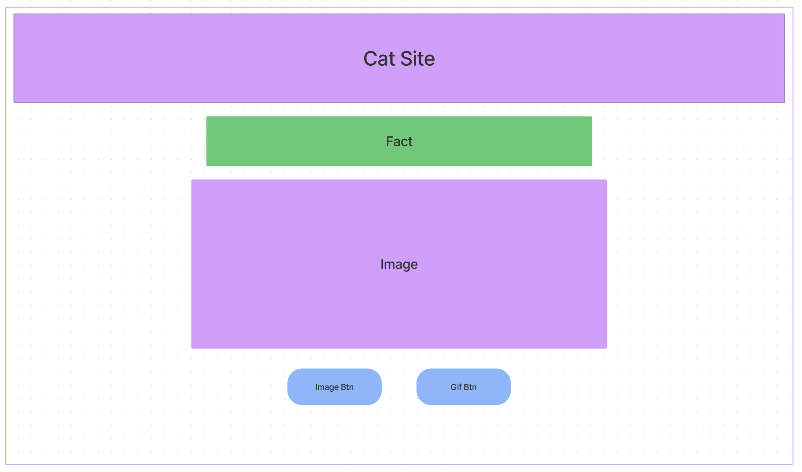

# Cat Ladies

#### By Liz Thomas, Katie Pundt, Christy Welch, Kim Brannian

#### _A website for cat lovers_

## Technologies Used

* _React.js_
* _JavaScript_
* _Node_
* _npx create-react-app_
* _Git_
* _eslint_
* _React Query_
* _[The Cat API](https://thecatapi.com/)_
* _[Cat Fact API](https://alexwohlbruck.github.io/cat-facts/docs/)_

## Description
This is a web application created using two APIs to generate random images, gifs, and cat facts. A user can click a button and generate a new static image of a cat or click a different button to generate a new cat gif. It has dancing images of each of the four authors' cats.

## Setup/Installation Requirements

### Your computer will need to have the following installed and set up:
* _[GIT](https://docs.github.com/en/get-started/quickstart/set-up-git)_
* _[Visual Studio Code](https://code.visualstudio.com/download)_
* _[Node](https://nodejs.dev/learn/how-to-install-nodejs)_

### File Setup

* _Once you have VSCode and GIT set up, you will need to open up your terminal, navigate to your Desktop and type the command:_
`git clone https://github.com/ekthomas25/cat-ladies.git`

* _This will clone the repository to your desktop and you will be able to then open the folder in VSCode._
* _Open the terminal in VSCode and navigate to_ `cat-ladies` _and type the following command:_ `npm install`
* _To view the project enter the following command in your terminal: `npm run start`_

## Known Bugs

* _No known issues_

## License
_[MIT License](https://opensource.org/licenses/MIT)_

_If you have any questions or would like to reach out for any reason, please don't hesitate to send an email to [thomas.elizabeth.k@gmail.com](mailto:thomas.elizabeth.k@gmail.com)._

Copyright (c) 2022 Elizabeth Thomas, Katie Pundt, Christy Welch, Kim Brannian